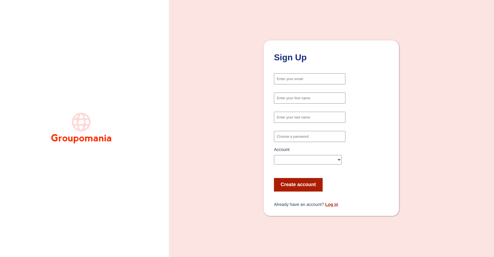

<h1 align="center">Groupomania</h1>

  OpenClassrooms Project for The <a href="https://openclassrooms.com/en/paths/141-web-developer#path-tabs" target="_blank">Web Developer Training Programm</a>.

<!-- TABLE OF CONTENTS -->

## Table of Contents

- [Overview](#overview)
- [Built With](#built-with)
- [Features](#features)
- [Contact](#contact)

<!-- OVERVIEW -->

## Overview

The website is not online, one most download the repo and run 'node server' to see the application. 

### Built With

<!-- This section should list any major frameworks that you built your project using. Here are a few examples.-->
- [NodeJS] (https://nodejs.org/en/)
- [Express] (https://expressjs.com/)
- [MySql] (https://www.mysql.com/fr/)
- [Sequelize] (https://sequelize.org/)
- [VueJS3] (https://v3.vuejs.org/)
- [Axios] (https://axios-http.com/)
- [SASS] (https://sass-lang.com/)

## Features

<!-- List the features of your application or follow the template. Don't share the figma file here :) -->

This website was created as a submission to a project, part of a Training Programm. The challenge was to build an online social network which allows employees to better communicate in the workplace. Users can signup and create their account. After loging in, users land on a page where posts are displayed on a facebook-like wall. 

Users can add images to their posts, like them and comment them. 
Each user has access to his profile page and can modify their info as well as a profile pic. 

Users are free to delete their account whenever they want without justification. 

Multiple administrators members of the company also have access to the network throughout the day to moderate users, posts and comments.

The website is responsive and meets accessibility standards needs (WCAG). 

## Contact

- GitHub [@LKurdi292](https://{github.com/lkurdi292})
- Mail [kurdilora@gmail.com]
